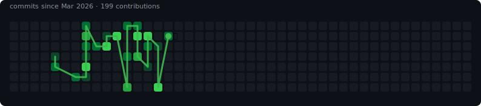

---

## projects

 

<table>
<tr>
<td width="50%" valign="top">

### 🛒 [Smart Shopping List](https://github.com/nicole732470/smartshoppinglist)

`JavaScript` · grocery list that remembers what you actually buy

</td>
<td width="50%" valign="top">

### 🍷 [Voice Wine Explorer](https://github.com/nicole732470/Voice-Wine-Explorer)

`JavaScript` · talk to find wines you'll like

</td>
</tr>
<tr>
<td width="50%" valign="top">

### 🤖 [AutoApply](https://github.com/nicole732470/AutoApply)

`Python` · job application workflow automation

</td>
<td width="50%" valign="top">

### 📊 [Analytics Internship](https://github.com/nicole732470/analytics-internship)

`Python` · data analysis samples

</td>
</tr>
<tr>
<td width="50%" valign="top">

### 📝 [Todo App](https://github.com/nicole732470/todoapp)

`Ruby` · software studio coursework

</td>
<td width="50%" valign="top">

### 🔍 LCA LinkedIn Checker

`Python` `SQLite` `Chrome MV3` · H-1B sponsor lookup on LinkedIn  
🔒 private repo — ask me for a demo

</td>
</tr>
</table>

---

## 🐍 commits since mar 2026

<picture>
  <source media="(prefers-color-scheme: dark)" srcset="./assets/spring-snake-dark.svg">
  <source media="(prefers-color-scheme: light)" srcset="./assets/spring-snake.svg">
  
</picture>

---

### bored?

**[🎮 play commit catcher](https://nicole732470.github.io/nicole732470/)** — catch ✨, dodge 🐛, 30 sec

← → or drag · built for this profile

