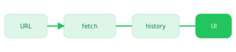
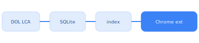
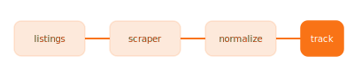
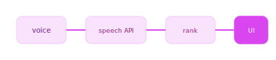

 

<pre style="font-size:16px;line-height:1.65;text-align:center;margin:0;">
  ✧ ˚  n i c o l e   l i  ˚ ✧

       (\__/)
       (•ㅅ•)  hi — data × product · chicago 🌆
      /  づ   northwestern · open to work · i ship small tools ♡
</pre>

 

<a href="#p1" style="display:inline-block;background:#16a34a;color:#fff;padding:7px 13px;border-radius:8px;text-decoration:none;font-size:12px;font-weight:600;margin:3px;">01 · PriceTracker</a>
<a href="#p2" style="display:inline-block;background:#2563eb;color:#fff;padding:7px 13px;border-radius:8px;text-decoration:none;font-size:12px;font-weight:600;margin:3px;">02 · LCA</a>
<a href="#p3" style="display:inline-block;background:#ea580c;color:#fff;padding:7px 13px;border-radius:8px;text-decoration:none;font-size:12px;font-weight:600;margin:3px;">03 · AutoApply</a>
<a href="#p4" style="display:inline-block;background:#c026d3;color:#fff;padding:7px 13px;border-radius:8px;text-decoration:none;font-size:12px;font-weight:600;margin:3px;">04 · Voice Wine</a>

 

<table width="100%" border="0" cellspacing="14" cellpadding="0">
<tr valign="top">
<td width="50%">

<b style="font-size:17px;color:#14532d;">🛒 <a href="https://github.com/nicole732470/smartshoppinglist" style="color:#14532d;">PriceTracker</a></b> 
paste a link → track price drops · folders · AI nudge

</td>
<td width="50%">

<b style="font-size:17px;color:#1e3a8a;">🔍 LCA LinkedIn Checker</b> 🔒 private 
h-1b sponsor signal overlaid on linkedin company pages

</td>
</tr>
<tr valign="top">
<td width="50%">

<b style="font-size:17px;color:#9a3412;">🤖 <a href="https://github.com/nicole732470/AutoApply" style="color:#9a3412;">AutoApply</a></b> 
scrape listings &amp; glue the boring apply workflow together

</td>
<td width="50%">

<b style="font-size:17px;color:#86198f;">🍷 <a href="https://github.com/nicole732470/Voice-Wine-Explorer" style="color:#86198f;">Voice Wine Explorer</a></b> 
talk mood &amp; budget → get a ranked wine shortlist back

</td>
</tr>
</table>

 

  

