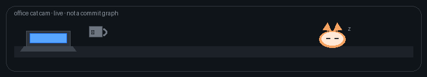

### 🐱 hi, i'm **nicole li** · mrow ~

🎓 **northwestern** · 🌆 **chicago** · she/her · 💻 data × product

😺 professional cat in human clothing · i build small tools that feel obvious after you use them  
⌨️ **shipping:** chrome extensions · sql pipelines · rails & js apps  
☕ **status:** caffeinated · job hunting · probably refactoring something i shouldn't  
🐾 **into right now:** product sense · h-1b data · side projects that actually ship  
🧶 **cat supervisor says:** stop pushing to main at 1am *(i will not listen)*  
🐟 **fun fact:** my github graph is patchy but my commit messages are cute

 

 

## 🐾 projects

| | | |
| :--- | :--- | :--- |
| **🛒 [smart shopping list](https://github.com/nicole732470/smartshoppinglist)**  `javascript`  grocery list that learns what you actually rebuy | **🍷 [voice wine explorer](https://github.com/nicole732470/Voice-Wine-Explorer)**  `javascript`  talk to it, get a wine shortlist back | **🤖 [autoapply](https://github.com/nicole732470/AutoApply)**  `python`  scraping + workflow glue for job applications |
| **📊 [analytics internship](https://github.com/nicole732470/analytics-internship)**  `python`  analysis notebooks & reporting samples | **📝 [todoapp](https://github.com/nicole732470/todoapp)**  `ruby`  software studio rails app with real tests | **🔍 lca linkedin checker**  `python` · `sqlite` · `chrome`  h-1b sponsor lookup on linkedin 🔒 private repo — ask for demo |

 

🐈‍⬛ *thanks for visiting — you may pet the cat mentally* 🐾

