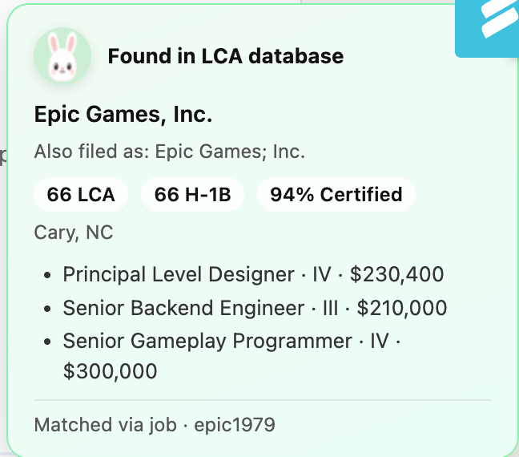
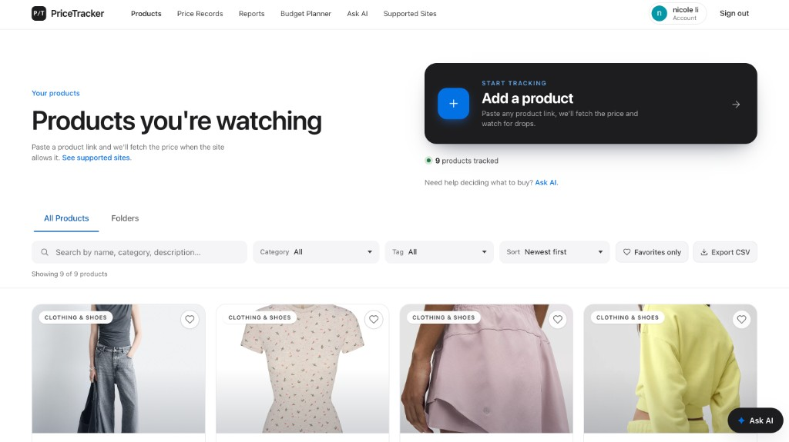

<div align="center">


</div>

```text
================================================================================
  ✧ ˚  *  n i c o l e   l i  *  ˚ ✧
       (\__/)
       (•ㅅ•)  product-minded engineer · data × product · chicago 🌆
      /  づ   northwestern · she/her · 💼 open to full-time roles

  ♡ i build small tools that feel obvious after you use them
  🛠 chrome extensions · sql pipelines · full-stack apps end-to-end
  📊 strengths: sql · prototyping · messy data → clear product decisions
  ☕ currently job hunting · hybrid / remote friendly · let's connect ↓
================================================================================
```

<br/>

**projects** — selected things i've built · data tools, extensions & product experiments

<table width="100%" border="0" cellspacing="16" cellpadding="0">
<tr valign="top">
<td width="50%">

<p style="border-left:4px solid #7dd3fc;padding-left:12px;margin:0 0 8px 0;">
<b>🔍 LCA LinkedIn Checker</b> · 🔒 private<br>
<sub>linkedin hides h-1b sponsor history — overlays DOL filing stats, roles & wages on company pages.</sub>
</p>

<table width="100%" border="0" cellspacing="0" cellpadding="0">
<tr valign="middle">
<td width="42%"></td>
<td width="58%"><pre style="font-size:11px;margin:0;line-height:1.35;">
DOL LCA (786k+)
      │
  SQLite + SQL
      │
employer index
      │
Chrome MV3 ext
</pre></td>
</tr>
</table>

</td>
<td width="50%">

<p style="border-left:4px solid #fdba74;padding-left:12px;margin:0 0 8px 0;">
<b>🤖 <a href="https://github.com/nicole732470/AutoApply">AutoApply</a></b><br>
<sub>applying at scale is copy-paste hell — scrapes listings, normalizes fields, tracks the workflow.</sub>
</p>

<div align="right">
<pre style="font-size:11px;margin:0;line-height:1.35;text-align:left;display:inline-block;">
job listings
      │
   scraper
      │
  normalize
      │
workflow / track
</pre>
</div>

</td>
</tr>
<tr valign="top">
<td width="50%">

<p style="border-left:4px solid #86efac;padding-left:12px;margin:0 0 8px 0;">
<b>🛒 <a href="https://github.com/nicole732470/smartshoppinglist">PriceTracker</a></b><br>
<sub>paste a product link and watch prices over time — folders, alerts, and an AI nudge when you're stuck.</sub>
</p>

<table width="100%" border="0" cellspacing="0" cellpadding="0">
<tr valign="middle">
<td width="42%"></td>
<td width="58%"><pre style="font-size:11px;margin:0;line-height:1.35;">
product URL
      │
price fetcher
      │
price history
      │
  dashboard
</pre></td>
</tr>
</table>

</td>
<td width="50%">

<p style="border-left:4px solid #e9a8f7;padding-left:12px;margin:0 0 8px 0;">
<b>🍷 <a href="https://github.com/nicole732470/Voice-Wine-Explorer">Voice Wine Explorer</a></b><br>
<sub>wine apps want twelve filters before dinner — talk mood, food, budget and get a ranked shortlist.</sub>
</p>

<div align="right">
<pre style="font-size:11px;margin:0;line-height:1.35;text-align:left;display:inline-block;">
 voice / text
      │
  speech API
      │
ranking engine
      │
   shortlist UI
</pre>
</div>

</td>
</tr>
</table>

<br/>

<div align="center">

**open to opportunities** · chicago · [github.com/nicole732470](https://github.com/nicole732470)

</div>
