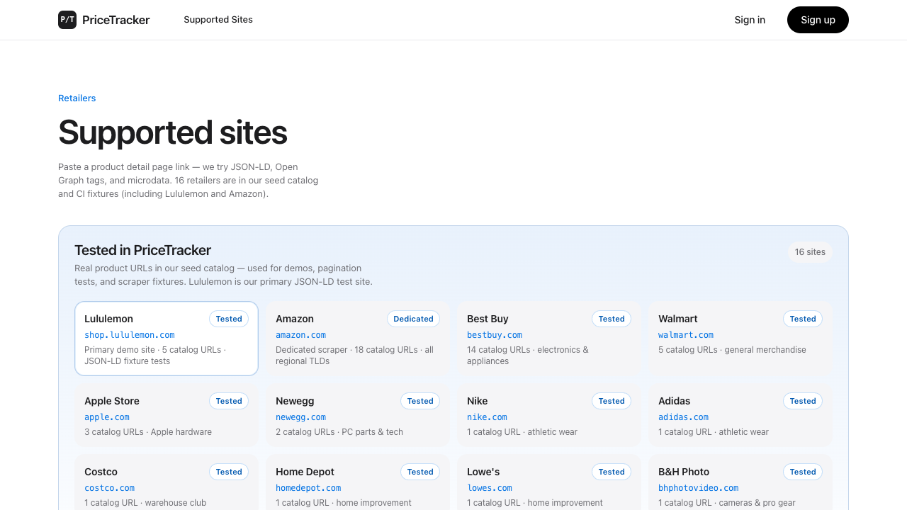
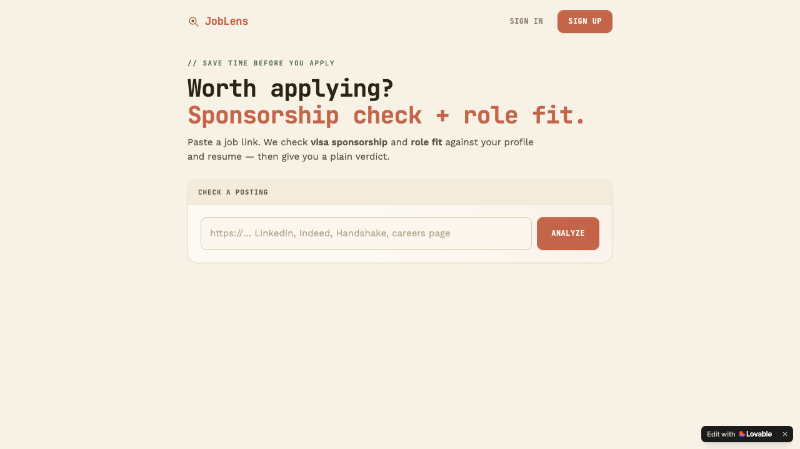
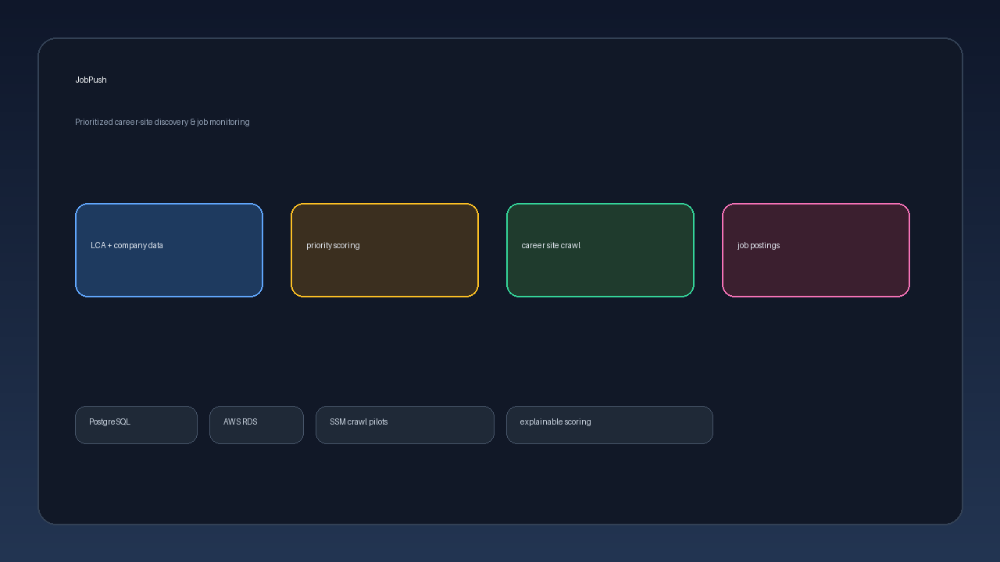

 

<pre style="font-size:15px;line-height:1.7;text-align:center;margin:0;color:#57606a;">
  ✧ ˚  n i c o l e   l i  ˚ ✧

       (\__/)
       (•ㅅ•)  engineering × product
      /  づ   chicago · northwestern · tencent · open to work
</pre>

 

## projects

 

<b style="font-size:17px;color:#24292f;display:block;margin-bottom:10px;">🛒 <a href="https://github.com/nicole732470/smartshoppinglist" style="color:#24292f;text-decoration:none;">PriceTracker</a></b>

A full-stack price watching app — paste a product URL, track history across stores, and get notified when prices drop.

· Paste a retailer link → auto-fetch title, image, and current price 
· Dashboard with price history charts and target-price alerts 
· 16 supported retailers (Amazon, Best Buy, Walmart, Lululemon, Apple, and more) 
· Account settings, email notifications, Cucumber + RSpec test suite

<code>Ruby on Rails</code> · <code>PostgreSQL</code> · <code>Heroku</code> · <code>Active Storage</code>

<pre style="font-size:11px;line-height:1.5;color:#57606a;background:#f6f8fa;border:1px solid #d0d7de;border-radius:8px;padding:12px;margin:0;white-space:pre-wrap;word-wrap:break-word;">
URL → fetch metadata → price history → dashboard + alerts
</pre>

<a href="https://github.com/nicole732470/smartshoppinglist" style="color:#0969da;">GitHub</a>
&nbsp;·&nbsp;
<a href="https://smart-shoppinglist-6ae31171e85c.herokuapp.com/" style="color:#0969da;">live app</a>

<b style="font-size:17px;color:#24292f;display:block;margin-bottom:10px;">🔍 <a href="https://github.com/nicole732470/joblens" style="color:#24292f;text-decoration:none;">JobLens</a></b>

Visa-aware job-fit assistant — paste a posting or use the Chrome extension on LinkedIn and get an evidence-backed Apply / Consider / Skip report.

· DOL H-1B / LCA employer history lookup on every company 
· Role, Resume, Location, and Company fit scoring with cited evidence 
· Preference and dealbreaker checks against your profile 
· Same API + report for web app and LinkedIn Chrome extension 
· FastAPI + LangGraph pipeline with deterministic guardrails

<code>FastAPI</code> · <code>LangGraph</code> · <code>PostgreSQL</code> · <code>AWS RDS</code> · <code>Chrome MV3</code> · <code>React</code>

<pre style="font-size:11px;line-height:1.5;color:#57606a;background:#f6f8fa;border:1px solid #d0d7de;border-radius:8px;padding:12px;margin:0;white-space:pre-wrap;word-wrap:break-word;">
JD → LCA lookup → parallel fit scores → guardrails → verdict
</pre>

<a href="https://github.com/nicole732470/joblens" style="color:#0969da;">GitHub</a>
&nbsp;·&nbsp;
<a href="https://job-lens-main.lovable.app" style="color:#0969da;">live app</a>

<b style="font-size:17px;color:#24292f;display:block;margin-bottom:10px;">🚀 <a href="https://github.com/nicole732470/jobpush" style="color:#24292f;text-decoration:none;">JobPush</a></b>

Prioritized company career-site discovery and official job-posting monitoring — the crawl layer behind the JobLens ecosystem.

· Explainable priority scoring from DOL LCA data (target SOC, salary, Chicago metro, and more) 
· <code>company_targets</code> audit table refreshed from shared company + LCA sources 
· Career-site discovery pilots with adapter-specific crawl execution 
· Shares AWS RDS with JobLens; owns the <code>jobpush</code> PostgreSQL schema 
· Documented crawl policy, data model, and SSM-based deployment workflows

<code>PostgreSQL</code> · <code>AWS RDS</code> · <code>SSM</code> · <code>Python</code> · <code>SQL migrations</code>

<pre style="font-size:11px;line-height:1.5;color:#57606a;background:#f6f8fa;border:1px solid #d0d7de;border-radius:8px;padding:12px;margin:0;white-space:pre-wrap;word-wrap:break-word;">
LCA + company data → priority score → career-site crawl → job postings
</pre>

<a href="https://github.com/nicole732470/jobpush" style="color:#0969da;">GitHub</a>

 

<picture>
  <source media="(prefers-color-scheme: dark)" srcset="https://raw.githubusercontent.com/nicole732470/nicole732470/output/github-contribution-grid-snake-dark.svg">
  <source media="(prefers-color-scheme: light)" srcset="https://raw.githubusercontent.com/nicole732470/nicole732470/output/github-contribution-grid-snake.svg">
  
</picture>

