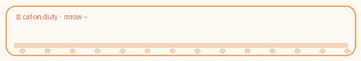

<h3 align="left">🐱 nicole li · <code>data × product</code> · chicago</h3>

<table width="100%">
<tr>
<td>

<table>
<tr>
<td style="background-color:#fff8f3; border:2px solid #f4a261; border-radius:16px; padding:18px 22px;">

<pre style="font-size:14px; line-height:1.55; margin:0;">
$ whoami
  <b>nicole li</b> · she/her · 🌆 chicago · 🎓 northwestern

$ cat about.txt
  💻 data × product · i build small tools that feel obvious after you use them
  🚀 shipping: chrome extensions · sql pipelines · rails &amp; js
  🎯 into: product sense · h-1b data · side projects that ship
  ☕ status: caffeinated · job hunting · probably refactoring something

$ ./cat_supervisor.sh
  🐱 mrow ~ stop pushing to main at 1am
  → exit 1 (ignored)  🐾🐾🐾
</pre>

</td>
</tr>
</table>

 

  

</td>
</tr>
</table>

 

## 🐾 projects

| | | |
| :--- | :--- | :--- |
| **🛒 [smart shopping list](https://github.com/nicole732470/smartshoppinglist)**  `javascript`  grocery list that learns what you actually rebuy | **🍷 [voice wine explorer](https://github.com/nicole732470/Voice-Wine-Explorer)**  `javascript`  talk to it, get a wine shortlist back | **🤖 [autoapply](https://github.com/nicole732470/AutoApply)**  `python`  scraping + workflow glue for job applications |
| **📊 [analytics internship](https://github.com/nicole732470/analytics-internship)**  `python`  analysis notebooks & reporting samples | **📝 [todoapp](https://github.com/nicole732470/todoapp)**  `ruby`  software studio rails app with real tests | **🔍 lca linkedin checker**  `python` · `sqlite` · `chrome`  h-1b sponsor lookup on linkedin 🔒 private repo — ask for demo |

 

🐈‍⬛ *thanks for visiting — you may pet the cat mentally* 🐾

