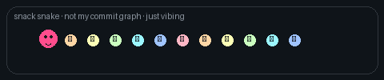

<table>
<tr>
<td width="42%" valign="top">

```text
╭──────────────────────────────────────╮
│  🌸✨ nicole li ✨🐰                  │
│  ──────────────────────────────────  │
│  🎓 northwestern  ·  🌆 chicago      │
│  💻 data × product × side projects   │
│                                      │
│       (\__/)                         │
│       (◕ᴗ◕)っ  hi hi ~               │
│      /  づ ♡                         │
│                                      │
│  ☕ fueled by coffee & deadlines     │
│  🧩 building things that feel        │
│     obvious after you use them       │
│  🎯 rn: job hunt · chrome ext · apps │
╰──────────────────────────────────────╯
```

</td>
<td width="58%" align="center" valign="middle">



<sub>🍡 snack snake — not my github graph, just a lil guy</sub>

</td>
</tr>
</table>

<br/>

## ✦ projects

<table>
<tr>
<td width="50%" valign="top">

**🛒 [smart shopping list](https://github.com/nicole732470/smartshoppinglist)**  
`javascript` · grocery list that learns what you rebuy

<br/>

**🤖 [autoapply](https://github.com/nicole732470/AutoApply)**  
`python` · scraping + workflow for job applications

<br/>

**📝 [todoapp](https://github.com/nicole732470/todoapp)**  
`ruby` · software studio rails app

</td>
<td width="50%" valign="top">

**🍷 [voice wine explorer](https://github.com/nicole732470/Voice-Wine-Explorer)**  
`javascript` · talk to it, get a wine shortlist

<br/>

**📊 [analytics internship](https://github.com/nicole732470/analytics-internship)**  
`python` · analysis notebooks & samples

<br/>

**🔍 lca linkedin checker** · `python` `sqlite` `chrome`  
h-1b sponsor lookup on linkedin · 🔒 private

</td>
</tr>
</table>

<br/>

<div align="center">

✧･ﾟ: *✧･ﾟ:* thanks for stopping by *:･ﾟ✧*:･ﾟ✧

</div>
